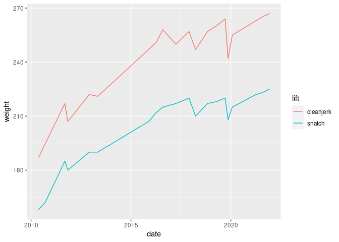

Untitled, in progress
================

I am looking for Lasha Talakhadze’s id.

``` r
athletes %>% filter(grepl("Talakhadze", name, ignore.case = TRUE))
```

    ## # A tibble: 2 × 7
    ##   athlete_id name           name_alt birthday   gender nation_current nation_all
    ##        <int> <chr>          <chr>    <date>     <chr>  <chr>          <chr>     
    ## 1       7627 TALAKHADZE La… <NA>     1993-10-02 M      GEO            GEO       
    ## 2      13398 TALAKHADZE Ak… <NA>     2001-07-29 M      GEO            GEO

``` r
lasha_id = 7627
```

``` r
results_sep <- results %>% # a dataset where each best lift/total is another line
  select(-contains("lift")) %>% 
  pivot_longer(c("snatch_best", "cleanjerk_best", "total"), names_to = "lift", values_to = "weight") %>% 
  mutate(lift = str_remove(lift, "_best"))


lasha <- results_sep %>% 
  filter(athlete_id == lasha_id, !is.na(weight)) %>% 
  left_join(events, by = 'event_id')
  

lasha %>% 
  filter(lift != "total") %>% 
  ggplot(aes(x = date)) +
    geom_line(aes(y = weight, color = lift))
```

<!-- -->
