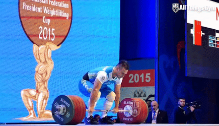
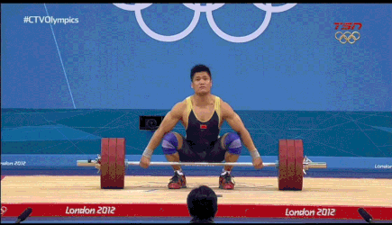
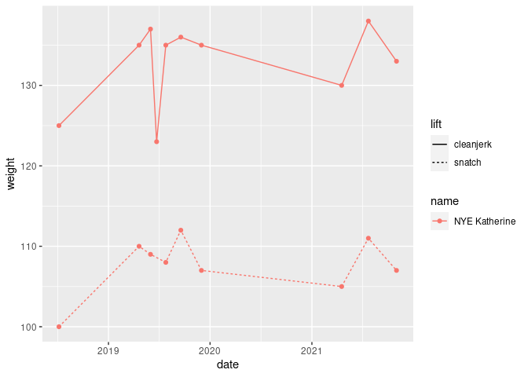

Analysis of International Weightlifting Competitions (in progress)
================

  The sport of weightlifting has a long history. It was first included
in the Olympics in the 1896. Today there are two lifts; the snatch and
the clean and jerk. There were originally many lifts, including one and
two hand versions. By 1928 there was the snatch, clean and jerk, and the
clean and press. In 1972 the press was removed and we’re left with the
two lifts we have today.  
  While it may seem like just a competition to see who can lift the
most, it is much more complicated than that. There are weight
categories. 10 per gender per age group. Each lift gets three attempts.
The competition starts off with with each athlete declaring an opening
snatch. The lowest weight is then put onto the bar. Each athlete then
goes out and attempts their declared weight. They have one minute to do
so after bar has been set. After each attempt, the athlete must declare
their next weight. The weight on the bar can never go down. In the case
of an athlete missing an attempt, they must try the same weight a second
time or go up in weight to put a few attempts from other athletes in
front of them. This is a trade-off between rest time and weight on the
bar. This is one of the things I will be looking at in my analysis.
Athletes fall one by one as they each take their third attempt. The last
three athlete that successfully make an attempt, and therefore lifted
the most weight, are guaranteed a medal for the snatch portion. There is
a 15 minute break between sessions, and then the same process is
repeated for clean and jerk. At the end there is also three medals given
to the athlete who lift the most combined, called the total. This medal
holds much more weight than the other two. The gold medal winner in the
total is called the category champion.

|       Clean and Jerk       |          Snatch          |
|:--------------------------:|:------------------------:|
|  |  |

``` r
search <- athletes %>% filter(
  grepl('katherine', name, ignore.case = TRUE) | grepl('martha', name, ignore.case = TRUE) | grepl('alwine', name, ignore.case = TRUE),
  grepl('USA', nations)
  )
ids = search$athlete_id

results_sep <- results %>% # a dataset where each best lift/total is another line
  select(-contains('lift')) %>% 
  pivot_longer(c('snatch_best', 'cleanjerk_best', 'total'), names_to = 'lift', values_to = 'weight') %>% 
  mutate(lift = str_remove(lift, '_best'))

results_sep %>% 
  filter(
    sapply(athlete_id, function(id) id %in% ids),
    !is.na(weight)) %>% 
  left_join(events, by = 'event_id') %>%
  ggplot(aes(x = date, y = weight, color = name)) +
    geom_line() +
    geom_point() +
    facet_wrap(vars(lift), scales = 'free', ncol = 1) +
    labs(title = 'comparison')
```

<!-- -->
