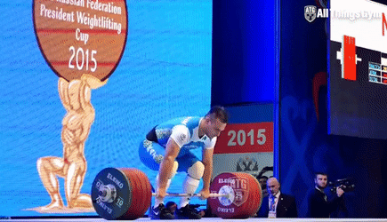
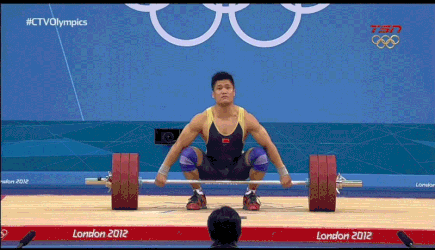

|   The sport of weightlifting has a long history. It was first included in the Olympics in the 1896. Today there are two lifts; the snatch and the clean and jerk. There were originally many lifts, including one and two hand versions. By 1928 there was the snatch, clean and jerk, and the clean and press. In 1972 the press was removed and we're left with the two lifts we have today.  
|   While it may seem like just a competition to see who can lift the most, it is much more complicated than that. There are weight categories. 10 per gender per age group. Each lift gets three attempts. 

Clean and Jerk            |  Snatch
:-------------------------:|:-------------------------:
  |  

```{r setup, include=FALSE}
knitr::opts_chunk$set(echo = TRUE, cache = TRUE, fig.height=4, fig.width=10)
library(tidyverse)
library(lubridate)
library(kableExtra)
library(grid)
library(gridExtra)
library(DT)
load('../all_data.Rdata')
```

# Exploration Of Past Olympic Games Results

```{r}
olympics <- events %>%  # only Olympic results
  filter(is_olympics == 1) %>%
  select(event_id) %>%
  left_join(results, by = "event_id") %>%
  arrange(desc(date), total_rank)

olympic_summary <- olympics %>% 
  pivot_longer(
    cols = c(
      "snatch_lift1", "snatch_lift2", "snatch_lift3",
      "cleanjerk_lift1", "cleanjerk_lift2", "cleanjerk_lift3"),
    names_to = "lift",
    values_to = "weight") %>% 
  filter(!dq) %>% 
  select(lift, weight, gender, bw, age) %>% 
  separate(
    col = lift,
    into = c("lift", "attempt"),
    sep = "_"
  ) %>% 
  mutate(
    attempt = as.numeric(str_remove(attempt, "lift")),
    success = weight > 1,
    weight = abs(weight)
  ) %>% 
  filter(weight != 0, !is.na(weight))

olympic_summary %>% 
  ggplot(aes(age, color = gender, fill = gender)) +
    geom_density(alpha = 0.05) +
    labs(title = "Distribution Of Age by Gender")

olympic_summary %>% 
  ggplot(aes(bw, color = gender, fill = gender)) +
    geom_density(alpha = 0.05) +
    labs(title = "Distribution Of Body Weight by Gender") +
    xlab("body weight (kg)")

olympic_summary %>%
  ggplot(aes(weight, fill = gender, color = gender, linetype = lift)) +
    geom_density(alpha = 0.05) +
    labs(title = "Distibution of Weight Lifted by Lift and Gender") +
    xlab("weight (kg)")

```


# Competition Strategy

The competition starts off with with each athlete declaring an opening snatch. The lowest weight is then put onto the bar. Each athlete then goes out and attempts their declared weight. They have one minute to do so after bar has been set. After each attempt, the athlete must declare their next weight. The weight on the bar can never go down. In the case of an athlete missing an attempt, they must try the same weight a second time or go up in weight. When they increase the weight it puts a few attempts from other athletes in front of them. This is a trade-off between rest time and weight on the bar. This is one of the things I will be looking at in my analysis. Athletes fall one by one as they each take their third attempt. The last three athletes that successfully make an attempt, and therefore lifted the most weight, are guaranteed a medal for the snatch portion. There is a 15 minute break between sessions, and then the same process is repeated for clean and jerk. At the end there is also three medals given to the athletes who lift the most combined, called the total. This medal holds much more weight than the other two. The gold medal winner in the total is called the category champion.

One of the most important aspects of the competition is allocating enough rest. As mentioned in the intro, it is a common strategy to go up in weight even if an athlete has missed an attempt. This is because going up in weight allows for more time between a missed lift and the next. I will make a group for each of the two strategies. Each observation is two subsequent lifts. The first lift is failed and the second lift is either made or missed.

```{r}
pairs <- bind_rows(
    olympics %>% select(snatch_lift1, snatch_lift2) %>%
      rename(lift1 = snatch_lift1, lift2 = snatch_lift2) %>% 
      mutate(type = "snatch", pos = "12"),
    olympics %>% select(snatch_lift2, snatch_lift3) %>%
      rename(lift1 = snatch_lift2, lift2 = snatch_lift3) %>% 
      mutate(type = "snatch", pos = "23"),
    olympics %>% select(cleanjerk_lift1, cleanjerk_lift2) %>%
      rename(lift1 = cleanjerk_lift1, lift2 = cleanjerk_lift2) %>% 
      mutate(type = "cleanjerk", pos = "12"),
    olympics %>% select(cleanjerk_lift2, cleanjerk_lift3) %>%
      rename(lift1 = cleanjerk_lift2, lift2 = cleanjerk_lift3) %>% 
      mutate(type = "cleanjerk", pos = "23")
  ) %>% 
  filter(lift1 < 0, abs(lift2) > 0) %>% 
  mutate(
    jump = abs(lift2) - abs(lift1),
    made_lift2 = lift2 > 0) %>% 
  rowid_to_column()

pairs %>% datatable(rownames = FALSE)
```

Note that a negative weight means it is a failed attempt.

```{r}
print('P(made lift 2):')
mean(pairs$made_lift2)
```
Only 45% of lifts after a miss are made.

Splitting into groups. No jump and a jump > 0.

```{r}
big_jump <- pairs %>% filter(jump > 0)
no_jump <- pairs %>% filter(jump == 0)

made <- c(sum(big_jump$made_lift2), sum(no_jump$made_lift2))
total <- c(nrow(big_jump), nrow(no_jump))
tibble(jump = c("big", "none"), made, total, prop = round(made/total,4)) %>%
  datatable(options = list(dom = 't'), width = 200, rownames = FALSE, class = 'cell-border stripe')
```

Proportion test with the hypotheses:
$$H_0:p_{\text{sucess after jump}}-p_{\text{sucess after no jump}}=0$$
$$H_A:p_{\text{sucess after jump}}-p_{\text{sucess after no jump}}\ne0$$

```{r}
prop.test(made, total)
```

The results are significant. So it is safe to say that the benefits of making a larger jump are not worth the increase risk of failing an attempt. 

I also want to test the difference when the two subsequent lifts are first and second or second and third.

```{r}
big_jump_23 <- pairs %>% filter(jump > 0, pos == "23")
no_jump_23 <- pairs %>% filter(jump == 0, pos == "23")
big_jump_12 <- pairs %>% filter(jump > 0, pos == "12")
no_jump_12 <- pairs %>% filter(jump == 0, pos == "12")

made_23 <- c(sum(big_jump_23$made_lift2), sum(no_jump_23$made_lift2))
total_23 <- c(nrow(big_jump_23), nrow(no_jump_23))
made_12 <- c(sum(big_jump_12$made_lift2), sum(no_jump_12$made_lift2))
total_12 <- c(nrow(big_jump_12), nrow(no_jump_12))

tibble(jump = c("big 23", "none 23", "big 12", "none 12"), made = c(made_23, made_12), total = c(total_23, total_12), prop = round(c(made_23/total_23, made_12/total_12), 4)) %>%
  datatable(options = list(dom = 't'), width = 300, rownames = FALSE, class = 'cell-border stripe')

prop.test(made_23, total_23)
prop.test(made_12, total_12)
```

The probabilities for 2 & 3 are much closer than 1 & 2. 


# example athlete comparison
```{r}
results_long <- results %>% # a dataset where each best lift/total is another line
  select(-contains('lift')) %>% 
  pivot_longer(c('snatch_best', 'cleanjerk_best', 'total'), names_to = 'lift', values_to = 'weight') %>% 
  mutate(lift = str_remove(lift, '_best'))

search <- athletes %>% filter(
  grepl('katherine|martha|alwine', name, ignore.case = TRUE),
  grepl('USA', nations)
  )
ids <- search$athlete_id

results_long %>%
  left_join(events %>% select(event_id, age_group), by = 'event_id') %>%
  filter(
    sapply(athlete_id, function(id) id %in% ids),
    !is.na(weight)) %>% 
  ggplot(aes(x = age, y = weight, color = name)) +
    geom_line() +
    geom_point() +
    facet_wrap(vars(lift), scales = 'free', ncol = 1) +
    labs(title = 'comparison')
```

```{r}
search %>% datatable(options = list(dom = 't'))
```

